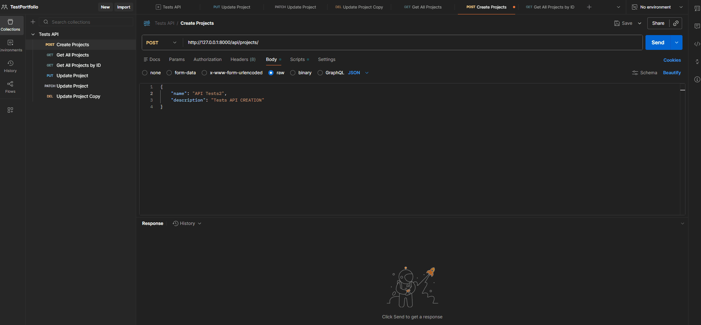

# API Automation Project --- Django & Postman E2E Testing

## Overview

This repository contains a Proof of Concept (POC) demonstrating API test
automation. The project focuses on validating a Django-based REST API
using Postman, ensuring reliable data integrity, contract testing, and
maintainable automation practices.

.
## Key Features

-   End-to-end API test automation with Postman.
-   Automated validation scripts (JavaScript) for status codes and data
    schema.
-   API Documentation following OpenAPI standards (Swagger).
-   Local backend integration with Django REST Framework.

## Tech Stack

-   Postman
-   Python / Django
-   JavaScript (Postman Scripts)

## Getting Started

### Prerequisites

-   Python 3.10+
-   Postman Desktop

### Install & Setup

``` bash
# Clone the repository
git clone https://github.com/WillyPess/DjangoAPIGIT.git
cd DjangoAPIGIT

# Setup virtual environment
python -m venv venv
.\venv\Scripts\activate

# Install dependencies
pip install django djangorestframework django-cors-headers
```

### Running Tests

#### Start the Server

``` bash
python manage.py runserver
```

#### Execute Postman Suite

-   Import the collection found in
    `postman/Tests_API.postman_collection.json`.
-   Open the Postman Runner.
-   Drag the collection and click **Run Tests API**.

## Contact

-   GitHub: https://github.com/WillyPess
-   LinkedIn: https://www.linkedin.com/in/willy-pessoa/
